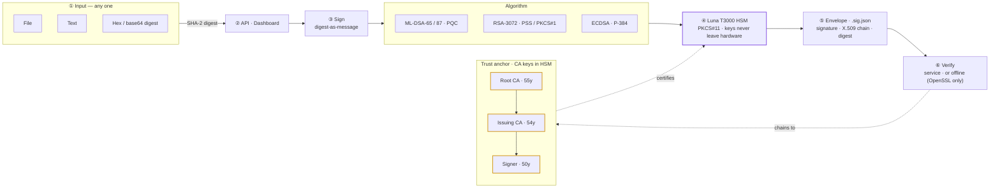

# ✈️ Project TailNumber

### detached Hash-Signing as a Service — **dHSaaS**

&nbsp;
&nbsp;
&nbsp;
&nbsp;

**Public overview of a private, access-controlled project.**

> ### ⚠️ Proprietary — source available on request
> This repository is the **public overview**; the implementation is maintained privately and is **not published**. No license or right is granted to use, copy, deploy, or create derivative works — see [`LICENSE`](LICENSE). The **live demo** below is open for evaluation. © 2026 rayketcham-lab.

---

## Overview

TailNumber is a **detached hash-signing service** for the SPEC42 Aerospace program. A client presents a **file, text, or a precomputed digest**; the service signs the digest with a key generated inside — and never leaving — a hardware security module, and returns a self-describing **signature envelope** (`.sig.json`: signature, X.509 certificate chain, digest, and provenance metadata). Because only the digest is signed under the `digest-as-message` profile, the artifact never leaves the client — arbitrarily large or classified payloads are in scope — and every envelope is **verifiable offline** against the pinned trust root with nothing but OpenSSL.

The service is **post-quantum first**: primary algorithms are **ML-DSA-65 / ML-DSA-87** (FIPS 204), with classical **RSA-3072** (RSASSA-PSS and PKCS#1 v1.5) and **ECDSA P-384** for hybrid and legacy-interoperable deployments. Authenticity is anchored in a three-tier X.509 hierarchy sized to the platform lifetime (Root 55y · Issuing 54y · Signer 50y).

**The envelope is a serialization, not a lock-in.** The same HSM-backed, CA-chained signature bytes can be re-emitted as a detached **JWS** (`PS256` / `RS256` / `ES384`), a **`COSE_Sign1`**, or a **CMS `.p7s`** — the wrapper changes, the trust root does not. Full spec + a mapping against **JWT / JWS · JAdES · COSE · CMS · CAdES · DSSE** in **[docs/INTEROP.md](docs/INTEROP.md)**.

## ▶ Try it live

The service is running — evaluate it without the source:

| | |
|---|---|
| **Dashboard** — hash, sign & verify in one pane | https://www.rayketcham.com/CRLs/tailnumber/db/ |
| **API docs** (Swagger) | https://www.rayketcham.com/CRLs/tailnumber/docs |
| **OpenAPI spec** | https://www.rayketcham.com/CRLs/tailnumber/openapi.json |

New to it? Click **ⓘ Instructions** in the dashboard header for a guided walkthrough.

## Capabilities

| | |
|---|---|
| **Post-quantum** | ML-DSA-65 / ML-DSA-87 (FIPS 204), plus RSA-3072 (PSS / PKCS#1 v1.5) and ECDSA P-384. |
| **Detached** | Signs a digest, never the artifact — large or classified payloads stay put. |
| **Offline-verifiable** | Every envelope verifies with nothing but OpenSSL + the published root. |
| **HSM-anchored** | Signing **and CA** keys are generated inside a Thales Luna T3000 HSM (FIPS 140-2 L3) and never leave it. |
| **Tamper-evident** | Every operation is written to a hash-chained, re-verified audit log. |
| **Interoperable** | Re-serializable as JWS / COSE / CMS without changing the trust root. |

## Built to outlive the airframe

Aerospace artifacts must stay verifiable for the **life of the platform** — decades, not the 1-3 years of a typical code-signing certificate. The trust chain is sized so each tier outlives the one below:

| Certificate | Validity |
|---|---|
| **Root CA** | **55 years** |
| **Issuing CA** | **54 years** |
| **Signer** | **50 years** (to the day) |

**A hard constraint — not a blocker.** 50-year validity crosses the RFC 5280 `UTCTime → GeneralizedTime` (year-2049) boundary that trips naive tooling; the pinned OpenSSL 3.5 and the offline verifier handle post-2049 `GeneralizedTime` cleanly, so the chain validates **today and decades out**.

## Source & licensing

The service, CA tooling, HSM backend, and deployment are maintained in a **private, access-controlled repository** — this page is the public overview, and the **live demo** above is open for evaluation. For source access or licensing enquiries, contact the maintainers.

**Proprietary — © 2026 rayketcham-lab. All rights reserved.**
