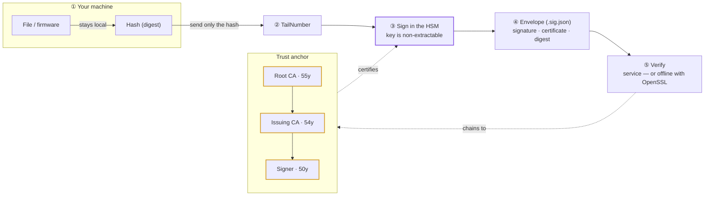

<div align="center">

# ✈️ Project TailNumber

### detached Hash-Signing as a Service — **dHSaaS**

[](LICENSE)
&nbsp;
&nbsp;
&nbsp;
&nbsp;[](https://www.rayketcham.com/CRLs/tailnumber/db/)

*Prove a file is authentic and untampered — with signatures built to outlive the aircraft and resist quantum computers.*

</div>

> **⚠️ Proprietary — source available on request.** This is the public overview; the implementation is private. No rights are granted to use, copy, or deploy — see [`LICENSE`](LICENSE). The **live demo** is open for evaluation. © 2026 rayketcham-lab.

---

## ⚡ Quick start — sign & verify in two commands

No signup, no SDK — the live service is open for evaluation. Only a **hash** is sent; your file never leaves your machine. Needs `curl`, `jq`, `openssl`.

```bash
API=https://www.rayketcham.com/CRLs/tailnumber/api/v1
FILE=yourfile.bin        # any file — e.g.  echo hello > yourfile.bin

# ① SIGN — hash locally, send only the digest, keep the returned proof (the envelope)
curl -s -X POST $API/sign -H 'content-type: application/json' \
  -d "$(jq -nc --arg d "sha256=$(openssl dgst -sha256 "$FILE" | awk '{print $NF}')" \
        '{key_label:"tailnumber-codesign-01", sig_alg:"rsa3072-pss-sha256", digest_alg:"sha256", digest:$d}')" \
  | tee "$FILE.sig.json" | jq '{signed_at, key: .key.label, signature: (.signature[0:44] + "…")}'

# ② VERIFY — one call: signature valid + chains to the root + matches this exact file
curl -s -X POST $API/verify/authentic -H 'content-type: application/json' \
  -d "$(jq -nc --argjson e "$(cat "$FILE.sig.json")" \
        --arg d "sha256=$(openssl dgst -sha256 "$FILE" | awk '{print $NF}')" \
        '{envelope: $e, digest: $d}')" | jq .
# => { "authentic": true, "signature_valid": true, "chain_ok": true, "digest_matches": true, "signer": { … } }
```

**Prove it:** change one byte of the file and run ② again — `"authentic"` flips to `false`.
Go deeper: [docs/TESTING.md](docs/TESTING.md) · every endpoint in [docs/API-COMMANDS.md](docs/API-COMMANDS.md) · keys can change while this POC is in development — list what's live: `curl -s $API/keys | jq -r '.keys[].label'`

---

## TL;DR

- **What it is** — a service that **digitally signs** software artifacts (firmware, packages, documents) and lets anyone **verify** them later.
- **How it works** — you send a **hash** of your file (not the file itself); the service signs that hash with a non-extractable key held in a security module (HSM) and returns a small, portable **proof** you can verify anywhere — even offline.
- **What makes it different** — **post-quantum** *and* **hybrid** (classical + PQC) signatures, a trust chain valid for **50 years**, and private keys that are **non-extractable** — generated inside the security module and never exported.
- **See it now** — [**live dashboard**](https://www.rayketcham.com/CRLs/tailnumber/db/) · [API docs](https://www.rayketcham.com/CRLs/tailnumber/docs)

---

## The problem

Aerospace software has to be **trusted for the life of the airframe** — 30, 40, 50 years. Two things break normal code-signing over that horizon:

1. **Certificates expire.** Off-the-shelf signing certs last 1–3 years; the platform lasts decades.
2. **Quantum computers are coming.** Today's RSA/ECDSA signatures may be forgeable by future quantum machines — a real risk for anything that must stay trustworthy for 50 years.

TailNumber is built for exactly this: **long-lived, post-quantum, HSM-anchored** signing (a SoftHSM software-HSM today, Thales Luna hardware in production).

## How it works

Three steps — and your file never leaves your machine:

1. **Hash** — you compute a digest (fingerprint) of your artifact locally.
2. **Sign** — you send only the digest; a **non-extractable** key inside a security module (HSM) signs it.
3. **Verify** — you get back a portable **envelope** (`.sig.json`) that anyone can check against the public trust root — through the service *or* offline with just OpenSSL.



## Try it live

The service is running — evaluate it without any source:

| | |
|---|---|
| **Dashboard** — hash, sign & verify in one page | https://www.rayketcham.com/CRLs/tailnumber/db/ |
| **API docs** (interactive) | https://www.rayketcham.com/CRLs/tailnumber/docs |
| **Usage metrics** (JSON) | https://www.rayketcham.com/CRLs/tailnumber/api/v1/metrics |

New to it? Click **ⓘ Instructions** in the dashboard header for a guided walkthrough.

**Want to test it yourself?** Follow **[docs/TESTING.md](docs/TESTING.md)** — sign a file, verify the signature, confirm the **file matches its envelope**, and prove **tamper-detection**, all copy-paste. In the dashboard, *Verify an envelope* now takes the **original file** and reports **✓ AUTHENTIC** (the file is hashed in your browser, never uploaded).

**Prefer the API?** The service exposes **~50 endpoints** — discovery, keys & trust material, single **and batch** sign/verify, the one-shot **`/verify/authentic`** ("is this file authentic?") check, and audit forensics. Every one is copy-paste in **[docs/API-COMMANDS.md](docs/API-COMMANDS.md)**, or drive them all from a single CLI, **[`examples/tailnumber-api.sh`](examples/tailnumber-api.sh)** (`sign` · `verify` · `sign-batch` · `verify-batch` · `keys` · `chain` · `algorithms` · …). Full interactive spec at [`/docs`](https://www.rayketcham.com/CRLs/tailnumber/docs) · [`/openapi.json`](https://www.rayketcham.com/CRLs/tailnumber/openapi.json).

## Features

| | |
|---|---|
| 🔮 **Post-quantum** | ML-DSA-65 / ML-DSA-87 (FIPS 204), classical RSA-3072 / **RSA-4096**, and ECDSA P-384. |
| 🔀 **Hybrid** | Sign with a classical **and** a PQC key over one digest — valid while *either* algorithm holds (CNSA 2.0 posture). |
| 🎛️ **Composable** | Don't settle for a pre-baked algorithm — compose it: RSA **padding** (PSS / PKCS#1 v1.5), **digest**, and **PSS salt**. |
| 🗝️ **Governed keys** | Keys are minted **on-box only** (never via the API), capturing provenance: creator, reason, PMA/TSO approval, DO-178C level. |
| 📎 **Detached** | Signs a hash, never the file — huge or classified artifacts stay on your side. |
| 🔓 **Offline-verifiable** | Every proof checks out with nothing but OpenSSL + the public root. |
| 🔐 **HSM-anchored** | Keys are generated inside the HSM and are non-extractable — they never leave the token. *SoftHSM (software HSM) today; Luna hardware in production.* |
| 📜 **Tamper-evident** | Every operation is written to a hash-chained audit log, re-verified on read. |
| 🔗 **Interoperable** | The same signature re-serializes as JWS, COSE, or CMS — no lock-in. |

## Built to outlive the airframe

Each tier of the trust chain outlives the one below, so a signature stays verifiable for the life of the platform:

| Certificate | Valid for |
|---|---|
| **Root CA** | **55 years** |
| **Issuing CA** | **54 years** |
| **Signer** | **50 years** |

50-year validity crosses a certificate-format boundary (the RFC 5280 year-2049 line) that trips a lot of tooling — TailNumber handles it, so proofs still verify decades out.

## Standards & interoperability

TailNumber's envelope is deliberately minimal, but the signature inside is standards-grade: the same HSM-backed, certificate-chained signature can be re-emitted as a detached **JWS**, a **COSE** object, or a **CMS/PKCS#7** `.p7s` — the wrapper changes, the trust root doesn't. Full spec + a mapping against JWT / JWS · JAdES · COSE · CMS · DSSE is in **[docs/INTEROP.md](docs/INTEROP.md)**.

## Tech stack & build

Built for a **minimal, auditable surface**: **Python 3.12** + **FastAPI / uvicorn**, one **pinned OpenSSL 3.5.4** for *all* cryptography (including post-quantum ML-DSA), and **PKCS#11** for keys — **SoftHSM2** today, a **Thales TCT Luna T-Series (T3000)** in production. Three direct Python dependencies, and no Python crypto library. The full stack, dependencies, server requirements, and runnable client scripts are in **[docs/STACK.md](docs/STACK.md)** — including two step-by-step examples: an API signer that prints an envelope to paste into the WebUI, and a SoftHSM/PKCS#11 in-token signing demo.

## FAQ

**Is my file uploaded to the service?**
No. Only its **hash** is sent. The file itself never leaves your machine — which is why huge or sensitive artifacts are fine.

**What does "detached" mean?**
The signature is a **separate** artifact from the file. You keep your file; the service stores nothing about it beyond the hash you chose to sign.

**What is "post-quantum"?**
Signature algorithms (ML-DSA, standardized in FIPS 204) designed to stay secure even against future **quantum computers** — important when a signature must be trusted for 50 years.

**What is "hybrid" signing?**
Signing the same digest with **both** a classical key (RSA / ECDSA) **and** a post-quantum key (ML-DSA). The result stays valid as long as *either* algorithm remains unbroken — the recommended hedge while PQC is still new.

**Can I customize the signature algorithm?**
Yes. Instead of a fixed named algorithm you **compose** the parameters that matter: RSA **padding** (PSS or PKCS#1 v1.5), **digest** (SHA-256 / 384 / 512), and **PSS salt length**. ECDSA exposes the digest; ML-DSA is parameter-free by design. Every custom combination still verifies through the service or offline with OpenSSL — and the dashboard shows a live *signing profile* plus the exact OpenSSL "show your work" evidence.

**How are keys created?**
On-box only, via a local CLI — **never over the API**. Creation touches the CA private key, so it's a privileged admin operation, and it records governance provenance (creator, reason, approver, PMA/TSO approval, DO-178C level) that travels with the key.

**Can I verify without trusting the service?**
Yes. Any envelope verifies **offline** with standard OpenSSL against the published root certificate. The service is convenient, not required.

**Why 50-year certificates?**
Because an aircraft's software must stay verifiable for the life of the aircraft. A signature has to **outlive what it signs**.

**Is the source code available?**
The implementation is **private**. The live demo is open for evaluation, and source access / licensing is available **on request**.

## Project status

- ✅ **Live** — the demo above is running and open for evaluation.
- ✅ **Signing CA deployed** — real trust chain, offline verification working.
- 🔐 **HSM** — the service **currently runs on SoftHSM2** (a software HSM: keys non-extractable via PKCS#11, generated and held in the token). The production design targets a **Thales TCT Luna T-Series (T3000)** (FIPS 140-2 Level 3) — the *same* PKCS#11 code path in tamper-resistant hardware.
- 🧪 **Maturity** — proof of concept **under active development**; endpoints, keys, and algorithms may change between visits. Not yet a production release.

## Source & licensing

The service, CA tooling, HSM backend, and deployment live in a **private, access-controlled repository**. This page is the public overview; the live demo is open. For source access or licensing, **contact the maintainers**.

**Proprietary — © 2026 rayketcham-lab. All rights reserved.**
