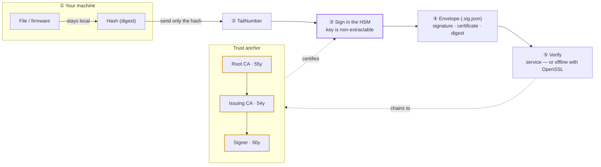

<div align="center">

# ✈️ Project TailNumber

### detached Hash-Signing as a Service — **dHSaaS**

[](LICENSE)
&nbsp;
&nbsp;
&nbsp;
&nbsp;[](https://www.rayketcham.com/CRLs/tailnumber/db/)
&nbsp;

*Prove a file is authentic and untampered — with signatures built to outlive the aircraft and resist quantum computers.*

**[Dashboard](https://www.rayketcham.com/CRLs/tailnumber/db/)** · **[API reference](https://www.rayketcham.com/CRLs/tailnumber/docs)** · **[Quick start](#-quick-start--sign--verify-in-two-commands)** · **[Verify it yourself](#proof--dont-take-our-word-for-it)**

</div>

> **⚠️ Proprietary — closed source.** This is the public overview; the implementation is private and **not distributed**. No rights are granted to use, copy, or deploy — see [`LICENSE`](LICENSE). The **live demo** is open for evaluation. © 2026 rayketcham-lab.

> **Live now** — SoftHSM2 backend, one **RSA-3072** signer, ~50 endpoints. Every command on this page
> and in [`docs/`](docs/) was executed against the running service on **2026-07-27**: 69 pass, 0 fail.
> Ask the service what it can do at this moment:
> `curl -s https://www.rayketcham.com/CRLs/tailnumber/api/v1/algorithms | jq -r '.available_algorithms[]'`

---

## ⚡ Quick start — sign & verify in two commands

No signup, no SDK — the live service is open for evaluation. Only a **hash** is sent; your file never leaves your machine. Needs `curl`, `jq`, `openssl`.

```bash
API=https://www.rayketcham.com/CRLs/tailnumber/api/v1
FILE=yourfile.bin        # any file — e.g.  echo hello > yourfile.bin

# ① SIGN — hash locally, send only the digest, keep the returned proof (the envelope)
curl -s -X POST $API/sign -H 'content-type: application/json' \
  -d "$(jq -nc --arg d "sha256=$(openssl dgst -sha256 "$FILE" | awk '{print $NF}')" \
        '{key_label:"tailnumber-codesign-01", sig_alg:"rsa3072-pss-sha256", digest_alg:"sha256", digest:$d}')" \
  | tee "$FILE.sig.json" | jq '{signed_at, key: .key.label, signature: (.signature[0:44] + "…")}'

# ② VERIFY — one call: signature valid + chains to the root + matches this exact file
curl -s -X POST $API/verify/authentic -H 'content-type: application/json' \
  -d "$(jq -nc --argjson e "$(cat "$FILE.sig.json")" \
        --arg d "sha256=$(openssl dgst -sha256 "$FILE" | awk '{print $NF}')" \
        '{envelope: $e, digest: $d}')" | jq .
# => { "authentic": true, "signature_valid": true, "chain_ok": true, "digest_matches": true, "signer": { … } }
```

**Prove it:** change one byte of the file and run ② again — `"authentic"` flips to `false`.

**③ Don't trust the service? Get the same verdict offline — nothing but OpenSSL:**

```bash
# unpack the envelope: signer cert → public key, and the raw signature
jq -r '.cert_chain[0]' "$FILE.sig.json" > signer.crt
openssl x509 -in signer.crt -pubkey -noout > signer.pub
jq -r '.signature' "$FILE.sig.json" | sed 's/^b64://' | base64 -d > sig.bin

# FILE ↔ SIGNATURE MATCH — hash the file YOURSELF, compare to the digest that was signed
openssl dgst -sha256 -binary "$FILE" > digest.bin
jq -r '.digest.value' "$FILE.sig.json" | sed 's/^b64://' | base64 -d | cmp - digest.bin \
  && echo "file matches the signed digest ✓"

# SIGNATURE VERIFICATION — is it genuine over exactly that digest? (the public key does the talking)
openssl pkeyutl -verify -pubin -inkey signer.pub -in digest.bin -sigfile sig.bin \
  -pkeyopt digest:sha256 -pkeyopt rsa_padding_mode:pss -pkeyopt rsa_pss_saltlen:auto
# => Signature Verified Successfully        (any change to the file → Signature Verification Failure)

# optional: anchor it — chain the signer to the published TailNumber root
curl -s $API/ca/root > root.crt
jq -r '.cert_chain[1]' "$FILE.sig.json" > issuing.crt
openssl verify -CAfile root.crt -untrusted issuing.crt signer.crt
# => signer.crt: OK
```

Go deeper: [docs/TESTING.md](docs/TESTING.md) · every endpoint in [docs/API-COMMANDS.md](docs/API-COMMANDS.md) · keys can change while this POC is in development — list what's live: `curl -s $API/keys | jq -r '.keys[].label'`

---

## TL;DR

- **What it is** — a service that **digitally signs** software artifacts (firmware, packages, documents) and lets anyone **verify** them later.
- **How it works** — you send a **hash** of your file (not the file itself); the service signs that hash with a non-extractable key held in a security module (HSM) and returns a small, portable **proof** you can verify anywhere — even offline.
- **What makes it different** — **post-quantum** *and* **hybrid** (classical + PQC) signatures, a trust chain valid for **50 years**, and private keys that are **non-extractable** — generated inside the security module and never exported.
- **See it now** — [**live dashboard**](https://www.rayketcham.com/CRLs/tailnumber/db/) · [API docs](https://www.rayketcham.com/CRLs/tailnumber/docs)

---

## The problem

Aerospace software has to be **trusted for the life of the airframe** — 30, 40, 50 years. Two things break normal code-signing over that horizon:

1. **Certificates expire.** Off-the-shelf signing certs last 1–3 years; the platform lasts decades.
2. **Quantum computers are coming.** Today's RSA/ECDSA signatures may be forgeable by future quantum machines — a real risk for anything that must stay trustworthy for 50 years.

TailNumber is built for exactly this: **long-lived, post-quantum, HSM-anchored** signing (a SoftHSM software-HSM today, Thales Luna hardware in production).

## How it works

Three steps — and your file never leaves your machine:

1. **Hash** — you compute a digest (fingerprint) of your artifact locally.
2. **Sign** — you send only the digest; a **non-extractable** key inside a security module (HSM) signs it.
3. **Verify** — you get back a portable **envelope** (`.sig.json`) that anyone can check against the public trust root — through the service *or* offline with just OpenSSL.


```mermaid
flowchart LR
  subgraph IN["① Your machine"]
    direction TB
    F["File / firmware"]
    H["Hash (digest)"]
    F -->|"stays local"| H
  end
  H -->|"send only the hash"| API["② TailNumber"]
  API --> HSM["③ Sign in the HSM<br/>key is non-extractable"]
  HSM --> ENV["④ Envelope (.sig.json)<br/>signature · certificate · digest"]
  ENV --> VER["⑤ Verify<br/>service — or offline with OpenSSL"]
  subgraph CA["Trust anchor"]
    R["Root CA · 55y"] --> IS["Issuing CA · 54y"] --> LC["Signer · 50y"]
  end
  CA -. certifies .-> HSM
  VER -. chains to .-> CA
  classDef anchor stroke:#d29922,stroke-width:2px;
  classDef hw stroke:#8957e5,stroke-width:2px;
  class R,IS,LC anchor;
  class HSM hw;
```

## Try it live

The service is running — evaluate it without any source:

| | |
|---|---|
| **Dashboard** — hash, sign & verify in one page | https://www.rayketcham.com/CRLs/tailnumber/db/ |
| **API reference** — three columns, per-endpoint **Try it**, runnable cURL / Python / JS | https://www.rayketcham.com/CRLs/tailnumber/docs |
| **Swagger UI** | https://www.rayketcham.com/CRLs/tailnumber/docs/swagger |
| **OpenAPI spec** (JSON) | https://www.rayketcham.com/CRLs/tailnumber/openapi.json |
| **What's live right now** | https://www.rayketcham.com/CRLs/tailnumber/api/v1/algorithms |
| **Usage metrics** (JSON) | https://www.rayketcham.com/CRLs/tailnumber/api/v1/metrics |

New to it? Click **ⓘ Instructions** in the dashboard header for a guided walkthrough.

The samples on `/docs` are **real, not illustrative** — the digest is a genuine SHA-256 and the verify
endpoints ship a signed envelope, so copying the `/verify/authentic` sample and running it returns
`authentic: true` with the chain and digest checks included. Nothing to substitute first.

**Want to test it yourself?** Follow **[docs/TESTING.md](docs/TESTING.md)** — sign a file, verify the signature, confirm the **file matches its envelope**, and prove **tamper-detection**, all copy-paste. In the dashboard, *Verify an envelope* takes the **original file** and reports **✓ AUTHENTIC** (the file is hashed in your browser, never uploaded).

**Prefer the API?** The service exposes **~50 endpoints** — discovery, keys & trust material, single
**and batch** sign/verify, the one-shot **`/verify/authentic`** ("is this file authentic?") check, and
audit forensics. Every one is copy-paste in **[docs/API-COMMANDS.md](docs/API-COMMANDS.md)**, or drive
the lot from one CLI — **[`examples/tailnumber-api.sh`](examples/tailnumber-api.sh)**:

```bash
cd examples
./tailnumber-api.sh keys                          # what's live right now
./tailnumber-api.sh sign   firmware.bin           # -> firmware.bin.sig.json
./tailnumber-api.sh verify firmware.bin firmware.bin.sig.json   # => "authentic": true
```

24 subcommands (`sign` · `verify` · `sign-batch` · `verify-batch` · `keys` · `chain` · `algorithms` ·
`hash` · `raw` · …) — every one is exercised by the scorecard below.

## Proof — don't take our word for it

Claims are cheap in crypto. Everything here is checkable, and the checks ship in this repo:

| Run this | What it proves | Result on 2026-07-27 |
|---|---|---|
| [`examples/verify-all-commands.sh`](examples/verify-all-commands.sh) | Every documented command and CLI subcommand, executed against the live service | **69 pass · 0 fail · 3 by-design N/A** |
| [`examples/tailnumber-api-roundtrip.sh`](examples/tailnumber-api-roundtrip.sh) | The service's verdict matches **your own OpenSSL**, a tampered byte is rejected, and the signer chains to the root | match, tamper rejected |
| [`examples/tailnumber-loadtest.sh`](examples/tailnumber-loadtest.sh) | Sustained signing with per-iteration integrity **and** tamper checks | 100 sign + 100 verify, **0 errors, 0 tampers missed** |
| [`examples/pkcs11-sign-demo.sh`](examples/pkcs11-sign-demo.sh) | Key born in the token, digest signed in the token, verified with the public half — the Luna path in miniature | signature verified |

Signing latency, measured end-to-end through the reverse proxy (sequential loop, so this is
per-request latency, not a throughput ceiling):

| min | avg | p50 | p95 | max |
|---|---|---|---|---|
| 209 ms | 241 ms | 241 ms | **261 ms** | 265 ms |

The three by-design N/A are honest capability limits, not failures: key **export** (`bundle` / `pfx`)
is refused because SoftHSM keys are non-extractable, and **hybrid** signing needs an ML-DSA key that
only exists on Luna hardware. See [Project status](#project-status).

## Features

| | |
|---|---|
| 🔮 **Post-quantum** | ML-DSA-65 / ML-DSA-87 (FIPS 204), classical RSA-3072 / **RSA-4096**, and ECDSA P-384. |
| 🔀 **Hybrid** | Sign with a classical **and** a PQC key over one digest — valid while *either* algorithm holds (CNSA 2.0 posture). |
| 🎛️ **Composable** | Don't settle for a pre-baked algorithm — compose it: RSA **padding** (PSS / PKCS#1 v1.5), **digest**, and **PSS salt**. |
| 🗝️ **Governed keys** | Keys are minted **on-box only** (never via the API), capturing provenance: creator, reason, PMA/TSO approval, DO-178C level. |
| 📎 **Detached** | Signs a hash, never the file — huge or classified artifacts stay on your side. |
| 🔓 **Offline-verifiable** | Every proof checks out with nothing but OpenSSL + the public root. |
| 🔐 **HSM-anchored** | Keys are generated inside the token and are non-extractable — export is refused, the public half is served freely. *SoftHSM2 (a **software** HSM) today; Luna T-Series hardware in production — check it yourself: [key protection](#key-protection--softhsm-today-luna-next) · [docs/HSM.md](docs/HSM.md).* |
| 📜 **Tamper-evident** | Every operation is written to a hash-chained audit log, re-verified on read. |
| 🔗 **Interoperable** | The envelope is a wrapper, not a lock-in — the same signature bytes and X.509 chain map cleanly onto JWS, COSE, or CMS/PKCS#7. *Emitters are a roadmap item; the mapping is specified in [docs/INTEROP.md](docs/INTEROP.md).* |

*On the live demo today, **RSA-3072** (`rsa3072-pss-sha256` / `rsa3072-pkcs1-sha256`) is the only active algorithm — the demo holds a single RSA-3072 key in SoftHSM2. **RSA-4096**, **ECDSA P-384**, **ML-DSA**, and **hybrid** each require a key of that family and run on Luna **hardware**, not on this demo; asking for one here returns a clear `incompatible with key` error. All of them are exercised end-to-end in the project's acceptance suite — see [Project status](#project-status). List what's live: `curl -s $API/keys | jq -r '.keys[].label'`.*

## Key protection — SoftHSM today, Luna next

**The live demo runs on SoftHSM2, a *software* HSM.** Private keys are PKCS#11 token
objects marked sensitive and non-extractable, so the API cannot export them — but
SoftHSM's token database is a file on disk, so this is software protection, not
hardware. Production targets a **Thales TCT Luna T-Series (T3000)**, FIPS 140-2 Level 3.

Don't take the label's word for it — the service answers the question directly:

```bash
BASE=https://www.rayketcham.com/CRLs/tailnumber
curl -s $BASE/api/v1/hsm | jq '.backend.hardware'          # => false   (SoftHSM, not hardware)
curl -s $BASE/api/v1/hsm | jq -r '.modules[] | "\(.name): present=\(.present) vendor=\(.manufacturer // "-")"'
curl -s -o /dev/null -w '%{http_code}\n' $BASE/api/v1/keys/tailnumber-codesign-01/bundle   # => 404, non-extractable
```

`hardware` is derived from the PKCS#11 module actually loaded, not from a setting
someone types, and each module is reported by the vendor **it** reports — so a SoftHSM
library can't be dressed up as a Luna client. Export is refused while the *public* half
is served freely; that asymmetry is the point.

The signer-side evidence panel prints the command that really ran — no key file appears
in it, because on a PKCS#11 backend there isn't one:

```
openssl pkeyutl -sign -engine pkcs11 -keyform engine \
  -inkey "pkcs11:token=tailnumber;object=tailnumber-codesign-01;type=private" …
```

**Moving to Luna is a config change, not a code change** — both backends are the same
PKCS#11 code path; you point `[luna] module` at `libCryptoki2_64.so` and `token_label`
at the partition. A read-only preflight checks the pilot host first (module vendor is
genuinely Thales/SafeNet, NTLS registered, partition visible, mechanisms present,
OpenSSL `pkcs11` engine loadable) and the same checklist is published live:

```bash
curl -s $BASE/api/v1/hsm | jq '.luna_readiness.checklist'
```

Partition lifecycle — create, role/PED init, activate, rotate, delete — belongs to the
HSM admin, not to this service. Full detail, including the honest limitations (no FIPS
validation, no M-of-N, no post-quantum, and where the PIN lives) in
**[docs/HSM.md](docs/HSM.md)**.

## Built to outlive the airframe

Each tier of the trust chain outlives the one below, so a signature stays verifiable for the life of the platform:

| Certificate | Valid for |
|---|---|
| **Root CA** | **55 years** |
| **Issuing CA** | **54 years** |
| **Signer** | **50 years** |

50-year validity crosses a certificate-format boundary (the RFC 5280 year-2049 line) that trips a lot of tooling — TailNumber handles it, so proofs still verify decades out.

## Standards & interoperability

TailNumber's envelope is deliberately minimal, but the signature inside is standards-grade: the same HSM-backed, certificate-chained signature can be re-emitted as a detached **JWS**, a **COSE** object, or a **CMS/PKCS#7** `.p7s` — the wrapper changes, the trust root doesn't. **These emitters are not yet implemented**; the service ships `.sig.json` today, and the format mapping — against JWT / JWS · JAdES · COSE · CMS · DSSE, with fit and effort per target — is specified in **[docs/INTEROP.md](docs/INTEROP.md)** §8.

## Tech stack & build

Built for a **minimal, auditable surface**: **Python 3.12** + **FastAPI / uvicorn**, a **pinned OpenSSL 3.5.4** for post-quantum ML-DSA and offline verification, and **PKCS#11** for in-token signing — **SoftHSM2** today, a **Thales TCT Luna T-Series (T3000)** in production. Three direct Python dependencies, and no Python crypto library. The full stack, dependencies, server requirements, and runnable client scripts are in **[docs/STACK.md](docs/STACK.md)** — including two step-by-step examples: an API signer that prints an envelope to paste into the WebUI, and a SoftHSM/PKCS#11 in-token signing demo.

## FAQ

**Is my file uploaded to the service?**
No. Only its **hash** is sent. The file itself never leaves your machine — which is why huge or sensitive artifacts are fine.

**What does "detached" mean?**
The signature is a **separate** artifact from the file. You keep your file; the service stores nothing about it beyond the hash you chose to sign.

**What is "post-quantum"?**
Signature algorithms (ML-DSA, standardized in FIPS 204) designed to stay secure even against future **quantum computers** — important when a signature must be trusted for 50 years.

**What is "hybrid" signing?**
Signing the same digest with **both** a classical key (RSA / ECDSA) **and** a post-quantum key (ML-DSA). The result stays valid as long as *either* algorithm remains unbroken — the recommended hedge while PQC is still new.

**Can I customize the signature algorithm?**
Yes. Instead of a fixed named algorithm you **compose** the parameters that matter: RSA **padding** (PSS or PKCS#1 v1.5), **digest** (SHA-256 / 384 / 512), and **PSS salt length**. ECDSA exposes the digest; ML-DSA is parameter-free by design. Every custom combination still verifies through the service or offline with OpenSSL — and the dashboard shows a live *signing profile* plus the exact OpenSSL "show your work" evidence.

**How are keys created?**
On-box only, via a local CLI — **never over the API**. Creation touches the CA private key, so it's a privileged admin operation, and it records governance provenance (creator, reason, approver, PMA/TSO approval, DO-178C level) that travels with the key.

**Can I verify without trusting the service?**
Yes. Any envelope verifies **offline** with standard OpenSSL against the published root certificate. The service is convenient, not required.

**Why 50-year certificates?**
Because an aircraft's software must stay verifiable for the life of the aircraft. A signature has to **outlive what it signs**.

**Is the source code available?**
**No.** The implementation is **private and closed-source**, and is not distributed. The live demo is open for evaluation — the source itself is not available.

## Project status

- ✅ **Live** — the demo above is running and open for evaluation.
- ✅ **Signing CA deployed** — real trust chain, offline verification working.
- 🔐 **HSM** — the service **currently runs on SoftHSM2** (a software HSM: keys non-extractable via PKCS#11, generated and held in the token). The production design targets a **Thales TCT Luna T-Series (T3000)** (FIPS 140-2 Level 3) — the *same* PKCS#11 code path in tamper-resistant hardware.
- 🔑 **Algorithms on this demo** — SoftHSM2 is classical-only, so the live demo signs with **RSA-3072** and nothing else. ML-DSA (post-quantum), ECDSA P-384, RSA-4096, and hybrid are implemented and covered by the acceptance suite, but need Luna hardware to run here.
- 🧪 **Maturity** — proof of concept **under active development**; endpoints, keys, and algorithms may change between visits. Not yet a production release.

## Source

The service, CA tooling, HSM backend, and deployment live in a **private, access-controlled repository** and are **not distributed**. This page is the public overview; the live demo is open for evaluation. The source is not available.

**Proprietary — © 2026 rayketcham-lab. All rights reserved.**
