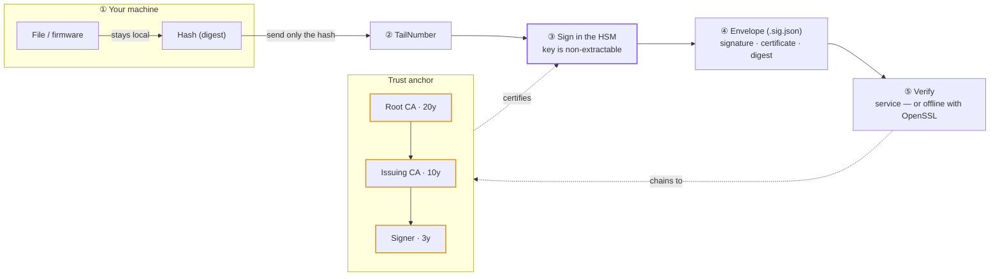

<div align="center">

# ✈️ Project TailNumber

### detached Hash-Signing as a Service — **dHSaaS**

[](LICENSE)
&nbsp;
&nbsp;
&nbsp;
&nbsp;[](https://www.rayketcham.com/CRLs/tailnumber/db/)
&nbsp;

*Prove a file is authentic and untampered — with signatures built to outlive the aircraft and resist quantum computers.*

**[Dashboard](https://www.rayketcham.com/CRLs/tailnumber/db/)** · **[API reference](https://www.rayketcham.com/CRLs/tailnumber/docs)** · **[Quick start](#-quick-start--sign--verify-in-two-commands)** · **[Verify it yourself](#proof--dont-take-our-word-for-it)**

</div>

> **⚠️ Proprietary — closed source.** This is the public overview; the implementation is private and **not distributed**. No rights are granted to use, copy, or deploy — see [`LICENSE`](LICENSE). The **live demo** is open for evaluation. © 2026 rayketcham-lab.

> **Live** — SoftHSM2 backend, one **RSA-3072** signer, ~50 endpoints. Every command on this page and
> in [`docs/`](docs/) is executed, not asserted: **69 pass / 0 fail** against the live service, last
> run **2026-08-20** — see [Proof](#proof--dont-take-our-word-for-it). Ask the service what it can do
> at this moment: `curl -s $API/algorithms | jq -r '.available_algorithms[]'`
> Ask the service what it can do at this moment:
> `curl -s https://www.rayketcham.com/CRLs/tailnumber/api/v1/algorithms | jq -r '.available_algorithms[]'`

---

## ⚡ Quick start — sign & verify in two commands

No signup, no SDK — the live service is open for evaluation. Only a **hash** is sent; your file never leaves your machine. Needs `curl`, `jq`, `openssl`.

```bash
API=https://www.rayketcham.com/CRLs/tailnumber/api/v1
FILE=yourfile.bin        # any file — e.g.  echo hello > yourfile.bin

# ① SIGN — hash locally, send only the digest, keep the returned proof (the envelope)
curl -s -X POST $API/sign -H 'content-type: application/json' \
  -d "$(jq -nc --arg d "sha256=$(openssl dgst -sha256 "$FILE" | awk '{print $NF}')" \
        '{key_label:"tailnumber-codesign-01", sig_alg:"rsa3072-pss-sha256", digest_alg:"sha256", digest:$d}')" \
  | tee "$FILE.sig.json" | jq '{signed_at, key: .key.label, signature: (.signature[0:44] + "…")}'

# ② VERIFY — one call: signature valid + chains to the root + matches this exact file
curl -s -X POST $API/verify/authentic -H 'content-type: application/json' \
  -d "$(jq -nc --argjson e "$(cat "$FILE.sig.json")" \
        --arg d "sha256=$(openssl dgst -sha256 "$FILE" | awk '{print $NF}')" \
        '{envelope: $e, digest: $d}')" | jq .
# => { "authentic": true, "signature_valid": true, "chain_ok": true, "digest_matches": true, "signer": { … } }
```

**Prove it:** change one byte of the file and run ② again — `"authentic"` flips to `false`.

**③ Don't trust the service? Get the same verdict offline — nothing but OpenSSL:**

```bash
# unpack the envelope: signer cert → public key, and the raw signature
jq -r '.cert_chain[0]' "$FILE.sig.json" > signer.crt
openssl x509 -in signer.crt -pubkey -noout > signer.pub
jq -r '.signature' "$FILE.sig.json" | sed 's/^b64://' | base64 -d > sig.bin

# FILE ↔ SIGNATURE MATCH — hash the file YOURSELF, compare to the digest that was signed
openssl dgst -sha256 -binary "$FILE" > digest.bin
jq -r '.digest.value' "$FILE.sig.json" | sed 's/^b64://' | base64 -d | cmp - digest.bin \
  && echo "file matches the signed digest ✓"

# SIGNATURE VERIFICATION — is it genuine over exactly that digest? (the public key does the talking)
openssl pkeyutl -verify -pubin -inkey signer.pub -in digest.bin -sigfile sig.bin \
  -pkeyopt digest:sha256 -pkeyopt rsa_padding_mode:pss -pkeyopt rsa_pss_saltlen:auto
# => Signature Verified Successfully        (any change to the file → Signature Verification Failure)

# optional: anchor it — chain the signer to the published TailNumber root
curl -s $API/ca/root > root.crt
jq -r '.cert_chain[1]' "$FILE.sig.json" > issuing.crt
openssl verify -CAfile root.crt -untrusted issuing.crt signer.crt
# => signer.crt: OK
```

Go deeper: [docs/TESTING.md](docs/TESTING.md) · every endpoint in [docs/API-COMMANDS.md](docs/API-COMMANDS.md) · keys can change while this POC is in development — list what's live: `curl -s $API/keys | jq -r '.keys[].label'`

---
## Step by step — sign through the API, verify with nothing but OpenSSL

Steps ① and ② talk to the service. **Steps ③–⑦ use nothing but `openssl` and `jq`** — no network,
no TailNumber code, no trust in this service. That is the point of a detached envelope: the proof
stands on its own once you have it.

Needs `curl`, `jq`, and OpenSSL 3.x — ML-DSA needs **OpenSSL 3.5+**.

```bash
API=https://www.rayketcham.com/CRLs/tailnumber/api/v1
KEY=tailnumber-codesign-01     # what's live:  curl -s $API/keys | jq -r '.keys[].label'
ALG=rsa3072-pss-sha256         # what it signs: curl -s $API/algorithms | jq -r '.available_algorithms[]'
FILE=firmware.bin              # any file  —  e.g.  echo hello > firmware.bin
```

### ① Hash the file locally

The digest is the **only** thing that ever leaves your machine.

```bash
DIGEST=$(openssl dgst -sha256 "$FILE" | awk '{print $NF}')
echo "sha256=$DIGEST"
# => sha256=5891b5b522d5df086d0ff0b110fbd9d21bb4fc7163af34d08286a2e846f6be03
```

### ② Sign it — send the digest, get an envelope back

```bash
curl -s -X POST $API/sign -H 'content-type: application/json' \
  -d "$(jq -nc --arg k "$KEY" --arg a "$ALG" --arg d "sha256=$DIGEST" \
        '{key_label:$k, sig_alg:$a, digest_alg:"sha256", digest:$d}')" \
  | tee "$FILE.sig.json" | jq '{signed_at, alg: .key.sig_alg, signer: .key.label}'
# => { "signed_at": "2026-08-20T…Z", "alg": "rsa3072-pss-sha256", "signer": "tailnumber-codesign-01" }
```

`$FILE.sig.json` is the detached envelope: signature, full X.509 chain, the digest that was signed,
and provenance. Keep it next to the artifact — it is what a verifier needs.

**Optional — ask the service for a verdict** (convenient, but never required):

```bash
curl -s -X POST $API/verify/authentic -H 'content-type: application/json' \
  -d "$(jq -nc --argjson e "$(cat "$FILE.sig.json")" --arg d "sha256=$DIGEST" \
        '{envelope: $e, digest: $d}')" | jq '{authentic, signature_valid, chain_ok, digest_matches}'
# => { "authentic": true, "signature_valid": true, "chain_ok": true, "digest_matches": true }
```

---

Everything below runs **offline**. Unplug the network if you like.

### ③ Unpack the envelope

```bash
jq -r '.cert_chain[0]' "$FILE.sig.json" > signer.crt      # the signing certificate
jq -r '.cert_chain[1]' "$FILE.sig.json" > issuing.crt     # the issuing CA
jq -r '.signature'     "$FILE.sig.json" | sed 's/^b64://' | base64 -d > sig.bin
openssl x509 -in signer.crt -pubkey -noout > signer.pub   # the public half — this does the talking
```

### ④ Prove the file matches the digest that was signed

Hash the artifact **yourself** and compare it to what the envelope claims. This is the step that
catches a modified binary.

```bash
openssl dgst -sha256 -binary "$FILE" > digest.bin
jq -r '.digest.value' "$FILE.sig.json" | sed 's/^b64://' | base64 -d | cmp - digest.bin \
  && echo "file matches the signed digest ✓"
```

### ⑤ Verify the signature over exactly that digest

```bash
openssl pkeyutl -verify -pubin -inkey signer.pub -in digest.bin -sigfile sig.bin \
  -pkeyopt digest:sha256 -pkeyopt rsa_padding_mode:pss -pkeyopt rsa_pss_saltlen:digest
# => Signature Verified Successfully
```

The flags depend on the algorithm in `.key.sig_alg` — read it from the envelope
(`jq -r '.key.sig_alg' "$FILE.sig.json"`) and use the matching row:

| `sig_alg` | digest | `pkeyutl -verify` flags | |
|---|---|---|---|
| `rsa3072-pss-sha256` | sha256 | `-pkeyopt digest:sha256 -pkeyopt rsa_padding_mode:pss -pkeyopt rsa_pss_saltlen:digest` | ✓ |
| `rsa3072-pkcs1-sha256` | sha256 | `-pkeyopt digest:sha256` | ✓ |
| `rsa4096-pss-sha384` | sha384 | `-pkeyopt digest:sha384 -pkeyopt rsa_padding_mode:pss -pkeyopt rsa_pss_saltlen:digest` | |
| `rsa4096-pkcs1-sha384` | sha384 | `-pkeyopt digest:sha384` | |
| `ecdsa-p384-sha384` | sha384 | *(none — the raw 48-byte digest is the input)* | ✓ |
| `ml-dsa-65` | sha384 | `-rawin` | ✓ |
| `ml-dsa-87` | sha512 | `-rawin` | ✓ |

✓ = executed end to end for this README. The RSA-4096 rows come from the validated flag table in
the private repo's `docs/OPENSSL.md` (regenerated by `tools/validate-sig-algs.sh`); there was no
RSA-4096 key in the test keystore. `rsa_pss_saltlen:auto` also verifies where `:digest` does.

### ⑥ Anchor it — chain the signer to the published root

Steps ④ and ⑤ prove the signature is **internally consistent**. They do not prove *who* signed it —
a forger can self-sign a certificate with the same name. This is the step that establishes trust.

```bash
curl -s $API/ca/root > root.crt          # fetch once, then keep it — this is your trust anchor
openssl verify -CAfile root.crt -untrusted issuing.crt signer.crt
# => signer.crt: OK
```

Once you hold `root.crt`, this is offline too. Pin it out of band and nothing in the chain depends
on the service being reachable — or on it still existing.

Look at what you just trusted:

```bash
openssl x509 -in signer.crt -noout -subject -issuer -dates -ext extendedKeyUsage
```

### ⑦ Prove it detects tampering

```bash
printf 'X' >> "$FILE"                                    # change one byte
openssl dgst -sha256 -binary "$FILE" > digest2.bin
openssl pkeyutl -verify -pubin -inkey signer.pub -in digest2.bin -sigfile sig.bin \
  -pkeyopt digest:sha256 -pkeyopt rsa_padding_mode:pss -pkeyopt rsa_pss_saltlen:digest
# => Signature Verification Failure
```

The same flip makes step ④ fail and `/verify/authentic` return `"authentic": false`. A signature is
only as good as its refusal to validate the wrong thing.


## TL;DR

- **What it is** — a service that **digitally signs** software artifacts (firmware, packages, documents) and lets anyone **verify** them later.
- **How it works** — you send a **hash** of your file (not the file itself); the service signs that hash with a non-extractable key held in a security module (HSM) and returns a small, portable **proof** you can verify anywhere — even offline.
- **What makes it different** — **post-quantum** *and* **hybrid** (classical + PQC) signatures, a trust chain built to stay verifiable for **50 years** by rotating through certificate generations (no single certificate lasts that long), and private keys that are **non-extractable** — generated inside the security module and never exported.
- **See it now** — [**live dashboard**](https://www.rayketcham.com/CRLs/tailnumber/db/) · [API docs](https://www.rayketcham.com/CRLs/tailnumber/docs)

---

## The problem

Aerospace software has to be **trusted for the life of the airframe** — 30, 40, 50 years. Two things break normal code-signing over that horizon:

1. **Certificates expire.** Off-the-shelf signing certs last 1–3 years; the platform lasts decades.
2. **Quantum computers are coming.** Today's RSA/ECDSA signatures may be forgeable by future quantum machines — a real risk for anything that must stay trustworthy for 50 years.

TailNumber is built for exactly this: **long-lived, post-quantum, HSM-anchored** signing (a SoftHSM software-HSM today, Thales Luna hardware in production).

## How it works

Three steps — and your file never leaves your machine:

1. **Hash** — you compute a digest (fingerprint) of your artifact locally.
2. **Sign** — you send only the digest; a **non-extractable** key inside a security module (HSM) signs it.
3. **Verify** — you get back a portable **envelope** (`.sig.json`) that anyone can check against the public trust root — through the service *or* offline with just OpenSSL.


```mermaid
flowchart LR
  subgraph IN["① Your machine"]
    direction TB
    F["File / firmware"]
    H["Hash (digest)"]
    F -->|"stays local"| H
  end
  H -->|"send only the hash"| API["② TailNumber"]
  API --> HSM["③ Sign in the HSM<br/>key is non-extractable"]
  HSM --> ENV["④ Envelope (.sig.json)<br/>signature · certificate · digest"]
  ENV --> VER["⑤ Verify<br/>service — or offline with OpenSSL"]
  subgraph CA["Trust anchor"]
    R["Root CA · 20y"] --> IS["Issuing CA · 10y"] --> LC["Signer · 3y"]
  end
  CA -. certifies .-> HSM
  VER -. chains to .-> CA
  classDef anchor stroke:#d29922,stroke-width:2px;
  classDef hw stroke:#8957e5,stroke-width:2px;
  class R,IS,LC anchor;
  class HSM hw;
```

## Try it live

The service is running — evaluate it without any source:

| | |
|---|---|
| **Dashboard** — hash, sign & verify in one page | https://www.rayketcham.com/CRLs/tailnumber/db/ |
| **API reference** — three columns, per-endpoint **Try it**, runnable cURL / Python / JS | https://www.rayketcham.com/CRLs/tailnumber/docs |
| **Swagger UI** | https://www.rayketcham.com/CRLs/tailnumber/docs/swagger |
| **OpenAPI spec** (JSON) | https://www.rayketcham.com/CRLs/tailnumber/openapi.json |
| **What's live right now** | https://www.rayketcham.com/CRLs/tailnumber/api/v1/algorithms |
| **Usage metrics** (JSON) | https://www.rayketcham.com/CRLs/tailnumber/api/v1/metrics |

New to it? Click **ⓘ Instructions** in the dashboard header for a guided walkthrough.

The samples on `/docs` are **real, not illustrative** — the digest is a genuine SHA-256 and the verify
endpoints ship a signed envelope, so copying the `/verify/authentic` sample and running it returns
`authentic: true` with the chain and digest checks included. Nothing to substitute first.

**Want to test it yourself?** Follow **[docs/TESTING.md](docs/TESTING.md)** — sign a file, verify the signature, confirm the **file matches its envelope**, and prove **tamper-detection**, all copy-paste. In the dashboard, *Verify an envelope* takes the **original file** and reports **✓ AUTHENTIC** (the file is hashed in your browser, never uploaded).

**Prefer the API?** The service exposes **~50 endpoints** — discovery, keys & trust material, single
**and batch** sign/verify, the one-shot **`/verify/authentic`** ("is this file authentic?") check, and
audit forensics. Every one is copy-paste in **[docs/API-COMMANDS.md](docs/API-COMMANDS.md)**, or drive
the lot from one CLI — **[`examples/tailnumber-api.sh`](examples/tailnumber-api.sh)**:

```bash
cd examples
./tailnumber-api.sh keys                          # what's live right now
./tailnumber-api.sh sign   firmware.bin           # -> firmware.bin.sig.json
./tailnumber-api.sh verify firmware.bin firmware.bin.sig.json   # => "authentic": true
```

24 subcommands (`sign` · `verify` · `sign-batch` · `verify-batch` · `keys` · `chain` · `algorithms` ·
`hash` · `raw` · …) — every one is exercised by the scorecard below.

## Proof — don't take our word for it

Claims are cheap in crypto. Everything here is checkable, the checks ship in this repo, and the
first two run **weekly against the live service** in CI
([`verify-live`](../../actions/workflows/verify-live.yml)) — so the numbers below are enforced
rather than asserted, and drift shows up here instead of in front of you.

| Run this | What it proves | Result (2026-08-20, live service) |
|---|---|---|
| [`examples/verify-all-commands.sh`](examples/verify-all-commands.sh) | Every documented command and CLI subcommand, executed against the live service | **69 pass · 0 fail · 3 by-design N/A** |
| [`examples/verify-docs-samples.py`](examples/verify-docs-samples.py) | Every request sample the [`/docs`](https://www.rayketcham.com/CRLs/tailnumber/docs) page generates — regenerated from `openapi.json` and run. Also fails a sample that returns 200 while rendering a placeholder nobody can copy | **41 ok · 0 fail · 4 by-design N/A** |
| [`examples/tailnumber-api-roundtrip.sh`](examples/tailnumber-api-roundtrip.sh) | The service's verdict matches **your own OpenSSL**, a tampered byte is rejected, and the signer chains to the root | match, tamper rejected |
| [`examples/tailnumber-loadtest.sh`](examples/tailnumber-loadtest.sh) | Sustained signing with per-iteration integrity **and** tamper checks | 100 sign + 100 verify, **0 errors, 0 tampers missed** |
| [`examples/pkcs11-sign-demo.sh`](examples/pkcs11-sign-demo.sh) | Key born in the token, digest signed in the token, verified with the public half — the Luna path in miniature | signature verified |

Signing latency, measured end-to-end through the reverse proxy (sequential loop, so this is
per-request latency, not a throughput ceiling):

| min | avg | p50 | p95 | max |
|---|---|---|---|---|
| 209 ms | 241 ms | 241 ms | **261 ms** | 265 ms |

Everything above was re-run against the live service on **2026-08-20**: **69 pass / 0 fail / 3 N/A**
and **41 ok / 0 fail / 4 N/A**, plus **18 of 18** steps of the
[walkthrough above](#step-by-step--sign-through-the-api-verify-with-nothing-but-openssl) on both live
RSA profiles — signed in the token, verified offline with OpenSSL alone, chained to the root, tampered
digest rejected.

The demo holds one RSA-3072 key, so the other algorithm families cannot be exercised here. They were
audited the same day on a clean instance carrying all four: **45 of 45** walkthrough steps across
**5 profiles** (RSA-PSS, RSA-PKCS#1, ECDSA P-384, ML-DSA-65, ML-DSA-87), **44 of 44** `/docs` samples,
and **61 of 61** in the private repo's hermetic acceptance suite.

The three by-design N/A are honest capability limits, not failures: key **export** (`bundle` / `pfx`)
is refused because SoftHSM keys are non-extractable, and **hybrid** signing needs an ML-DSA key that
only exists on Luna hardware. See [Project status](#project-status).

## Features

| | |
|---|---|
| 🔮 **Post-quantum** | ML-DSA-65 / ML-DSA-87 (FIPS 204), classical RSA-3072 / **RSA-4096**, and ECDSA P-384. |
| 🔀 **Hybrid** | Sign with a classical **and** a PQC key over one digest — valid while *either* algorithm holds (CNSA 2.0 posture). |
| 🎛️ **Composable** | Don't settle for a pre-baked algorithm — compose it: RSA **padding** (PSS / PKCS#1 v1.5), **digest**, and **PSS salt**. |
| 🗝️ **Governed keys** | Keys are minted **on-box only** (never via the API), capturing provenance: creator, reason, PMA/TSO approval, DO-178C level. |
| 📎 **Detached** | Signs a hash, never the file — huge or classified artifacts stay on your side. |
| 🔓 **Offline-verifiable** | Every proof checks out with nothing but OpenSSL + the public root. |
| 🔐 **HSM-anchored** | Keys are generated inside the token and are non-extractable — export is refused, the public half is served freely. *SoftHSM2 (a **software** HSM) today; Luna T-Series hardware in production — check it yourself: [key protection](#key-protection--softhsm-today-luna-next) · [docs/HSM.md](docs/HSM.md).* |
| 📜 **Tamper-evident** | Every operation is written to a hash-chained audit log, re-verified on read. |
| 🔗 **Interoperable** | The envelope is a wrapper, not a lock-in — the same signature bytes and X.509 chain map cleanly onto JWS, COSE, or CMS/PKCS#7. *Emitters are a roadmap item; the mapping is specified in [docs/INTEROP.md](docs/INTEROP.md).* |

*On the live demo today, **RSA-3072** (`rsa3072-pss-sha256` / `rsa3072-pkcs1-sha256`) is the only active algorithm — the demo holds a single RSA-3072 key in SoftHSM2. **RSA-4096**, **ECDSA P-384**, **ML-DSA**, and **hybrid** each require a key of that family and run on Luna **hardware**, not on this demo; asking for one here returns a clear `incompatible with key` error. All of them are exercised end-to-end in the project's acceptance suite — see [Project status](#project-status). List what's live: `curl -s $API/keys | jq -r '.keys[].label'`.*

## Key protection — SoftHSM today, Luna next

**The live demo runs on SoftHSM2, a *software* HSM.** Private keys are PKCS#11 token
objects marked sensitive and non-extractable, so the API cannot export them — but
SoftHSM's token database is a file on disk, so this is software protection, not
hardware. Production targets a **Thales TCT Luna T-Series (T3000)**, FIPS 140-2 Level 3.

Don't take the label's word for it — the service answers the question directly:

```bash
BASE=https://www.rayketcham.com/CRLs/tailnumber
curl -s $BASE/api/v1/hsm | jq '.backend.hardware'          # => false   (SoftHSM, not hardware)
curl -s $BASE/api/v1/hsm | jq -r '.modules[] | "\(.name): present=\(.present) vendor=\(.manufacturer // "-")"'
curl -s -o /dev/null -w '%{http_code}\n' $BASE/api/v1/keys/tailnumber-codesign-01/bundle   # => 404, non-extractable
```

`hardware` is derived from the PKCS#11 module actually loaded, not from a setting
someone types, and each module is reported by the vendor **it** reports — so a SoftHSM
library can't be dressed up as a Luna client. Export is refused while the *public* half
is served freely; that asymmetry is the point.

The signer-side evidence panel prints the command that really ran — no key file appears
in it, because on a PKCS#11 backend there isn't one:

```
openssl pkeyutl -sign -engine pkcs11 -keyform engine \
  -inkey "pkcs11:token=tailnumber;object=tailnumber-codesign-01;type=private" …
```

**Moving to Luna is a config change, not a code change** — both backends are the same
PKCS#11 code path; you point `[luna] module` at `libCryptoki2_64.so` and `token_label`
at the partition. A read-only preflight checks the pilot host first (module vendor is
genuinely Thales/SafeNet, NTLS registered, partition visible, mechanisms present,
OpenSSL `pkcs11` engine loadable) and the same checklist is published live:

```bash
curl -s $BASE/api/v1/hsm | jq '.luna_readiness.checklist'
```

Partition lifecycle — create, role/PED init, activate, rotate, delete — belongs to the
HSM admin, not to this service. Full detail, including the honest limitations (no FIPS
validation, no M-of-N, no post-quantum, and where the PIN lives) in
**[docs/HSM.md](docs/HSM.md)**.


## Key rotation and CA lifetime — how the chain survives 50 years

An aircraft's software has to stay verifiable for the life of the airframe. The instinct is to
issue a long certificate and be done, but **a 50-year certificate is not 50 years of trust**. Over
that horizon you will migrate algorithms (RSA today, ML-DSA tomorrow), replace HSMs and the people
holding their credentials, and possibly respond to a compromise. Each of those needs a *new key*
while everything already signed stays verifiable. So the thing that actually carries the chain is
**rotation** — certificate lifetime just buys the window to rotate inside.

### The rule

**Rotation mints the next key. It never destroys the previous one.**

Every predecessor stays resolvable: its certificate still chains, verification still answers for
it, and audit entries still name a key that exists. Deleting the outgoing key and reusing its
label — which is what this service used to do — silently rewrites what every historical envelope
and audit record points at. Retiring a key is a separate, deliberate act: stop signing with it,
let its certificate lapse, keep it resolvable.

| Kind | Pattern | Example |
|---|---|---|
| Signing key | `<name>-<seq>` | `tailnumber-codesign-01` → `-02` |
| CA generation | `<name>-g<N>` | `tn-root-g1` → `tn-root-g2` |

Padding is preserved so labels sort lexically, widening only on overflow (`-99` → `-100`); an
unsuffixed label is generation 1 by convention. `POST /api/v1/keys/{label}/rotate` reads the
predecessor's algorithm, issues the next label in the series from the same CA, and returns it with
`predecessor` and `predecessor_retained: true` — refusing with **409** rather than overwriting a
successor that already exists.

### The CA lifecycle — 20 / 10 / 3

**No certificate spans the platform life. A sequence of generations does.**

| Certificate | Valid for | Over a 50-year platform |
|---|---|---|
| **Root CA** | **20 years** | ~3 generations |
| **Issuing CA** | **10 years** | ~5 generations, two per root |
| **Signer** | **3 years** | ~17 generations |

An earlier build issued 55/54/50-year certificates so a single chain covered the whole platform
life. That is the wrong shape. It makes the root effectively un-rotatable — you never practise the
one procedure you will eventually depend on — and it stakes fifty years on one key and one
algorithm, which is precisely the bet post-quantum migration says not to make. Shorter tiers turn
rotation into routine maintenance instead of a once-in-a-career emergency.

A leaf can never outlive its issuer, so signer certificates sit *well* inside the issuing CA:
issuance has to stop far enough before the CA lapses that the certificates expire first. Each tier
is renewed around mid-life, so the successor is established and trusted before the predecessor
goes anywhere near expiry.

Certificates issued from about 2029 onward will cross the RFC 5280 year-2049 boundary where
`UTCTime` gives way to `GeneralizedTime` — a transition that trips a lot of certificate tooling.
The pinned OpenSSL 3.5 and the offline verifier handle post-2049 dates correctly.

### Rolling the CA — designed, not implemented

This is where the 50 years are won or lost, and **the shipped code does not do it**: `ensure_ca()`
creates a single unversioned root and issuing pair with no notion of generations. With a 20-year
root, crossing a root generation inside the platform life is no longer hypothetical — it happens
at least twice. The intended sequence:

1. Generate `tn-root-g2` in the HSM around year 10. `tn-root-g1` stays — it must keep validating
   everything issued under it.
2. Issue `tn-issuing-g2` from the new root.
3. **Overlap.** Both generations live at once: new signers come from `g2`, existing signers keep
   chaining to `g1` until they rotate.
4. Publish a **link certificate** — the new root's public key signed by the old root — so a
   verifier that only trusts `g1` can still build a path to `g2`. Skip this and every relying
   party in the field breaks the day you cut over.
5. Retire `g1` only once nothing still depends on it.

### The other half: expiry ≠ invalid

Rotation keeps *issuance* alive. It does not keep a decades-old signature *verifiable*, and with
these lifetimes that is no longer a footnote. A signer certificate lasts 3 years and its issuing CA
10; a firmware image signed in year 2 and checked in year 30 has an expired signer, an expired
issuing CA, and quite possibly a retired root. The signature is still cryptographically sound, but
a verifier evaluating trust at check time will reject it.

Long, deliberately over-provisioned certificates used to paper over this. On a 20/10/3 cycle they
no longer do, which makes **long-term validation load-bearing rather than optional**: an RFC 3161
signature timestamp proving the signature existed while its certificate was valid, embedded
revocation data so verification never needs a long-dead responder, and periodic archival
timestamps to outrun algorithm decay (JAdES-B-LTA / CAdES-LTA).

**TailNumber ships the sized trust chain, not LTV.** Those attributes are a documented roadmap
item, not shipped behaviour — see [`docs/INTEROP.md`](docs/INTEROP.md) §7 and
[`docs/ROTATION.md`](docs/ROTATION.md). Until they exist, treat the 50-year claim as resting on
rotation discipline plus archived verification evidence, not on the certificates alone.

## Standards & interoperability

TailNumber's envelope is deliberately minimal, but the signature inside is standards-grade: the same HSM-backed, certificate-chained signature can be re-emitted as a detached **JWS**, a **COSE** object, or a **CMS/PKCS#7** `.p7s` — the wrapper changes, the trust root doesn't. **These emitters are not yet implemented**; the service ships `.sig.json` today, and the format mapping — against JWT / JWS · JAdES · COSE · CMS · DSSE, with fit and effort per target — is specified in **[docs/INTEROP.md](docs/INTEROP.md)** §8.

## Tech stack & build

Built for a **minimal, auditable surface**: **Python 3.12** + **FastAPI / uvicorn**, a **pinned OpenSSL 3.5.4** for post-quantum ML-DSA and offline verification, and **PKCS#11** for in-token signing — **SoftHSM2** today, a **Thales TCT Luna T-Series (T3000)** in production. Three direct Python dependencies, and no Python crypto library. The full stack, dependencies, server requirements, and runnable client scripts are in **[docs/STACK.md](docs/STACK.md)** — including two step-by-step examples: an API signer that prints an envelope to paste into the WebUI, and a SoftHSM/PKCS#11 in-token signing demo.

## FAQ

**Is my file uploaded to the service?**
No. Only its **hash** is sent. The file itself never leaves your machine — which is why huge or sensitive artifacts are fine.

**What does "detached" mean?**
The signature is a **separate** artifact from the file. You keep your file; the service stores nothing about it beyond the hash you chose to sign.

**What is "post-quantum"?**
Signature algorithms (ML-DSA, standardized in FIPS 204) designed to stay secure even against future **quantum computers** — important when a signature must be trusted for 50 years.

**What is "hybrid" signing?**
Signing the same digest with **both** a classical key (RSA / ECDSA) **and** a post-quantum key (ML-DSA). The result stays valid as long as *either* algorithm remains unbroken — the recommended hedge while PQC is still new.

**Can I customize the signature algorithm?**
Yes. Instead of a fixed named algorithm you **compose** the parameters that matter: RSA **padding** (PSS or PKCS#1 v1.5), **digest** (SHA-256 / 384 / 512), and **PSS salt length**. ECDSA exposes the digest; ML-DSA is parameter-free by design. Every custom combination still verifies through the service or offline with OpenSSL — and the dashboard shows a live *signing profile* plus the exact OpenSSL "show your work" evidence.

**How are keys created?**
On-box only, via a local CLI — **never over the API**. Creation touches the CA private key, so it's a privileged admin operation, and it records governance provenance (creator, reason, approver, PMA/TSO approval, DO-178C level) that travels with the key.

**Can I verify without trusting the service?**
Yes. Any envelope verifies **offline** with standard OpenSSL against the published root certificate. The service is convenient, not required.

**How does a signature stay verifiable for 50 years?**
Because an aircraft's software must stay verifiable for the life of the aircraft, a signature has to **outlive what it signs** — but not by issuing one 50-year certificate. The chain is sized **20 / 10 / 3 years** (root / issuing / signer) and carried across the platform life by **rotation**: each generation is minted before the previous one lapses, and no predecessor is ever destroyed. See [Key rotation and CA lifetime](#key-rotation-and-ca-lifetime--how-the-chain-survives-50-years).

**Is the source code available?**
**No.** The implementation is **private and closed-source**, and is not distributed. The live demo is open for evaluation — the source itself is not available.

## Project status

- ✅ **Live** — the demo above is running and open for evaluation.
- ✅ **Signing CA deployed** — real trust chain, offline verification working.
- 🔐 **HSM** — the service **currently runs on SoftHSM2** (a software HSM: keys non-extractable via PKCS#11, generated and held in the token). The production design targets a **Thales TCT Luna T-Series (T3000)** (FIPS 140-2 Level 3) — the *same* PKCS#11 code path in tamper-resistant hardware.
- 🔑 **Algorithms on this demo** — SoftHSM2 is classical-only, so the live demo signs with **RSA-3072** and nothing else. ML-DSA (post-quantum), ECDSA P-384, RSA-4096, and hybrid are implemented and covered by the acceptance suite, but need Luna hardware to run here.
- 🧪 **Maturity** — proof of concept **under active development**; endpoints, keys, and algorithms may change between visits. Not yet a production release.


## Honest limitations

- **SoftHSM is not hardware.** Keys are non-extractable via PKCS#11, but its token DB is a file on
  disk — software protection. No FIPS validation, no M-of-N quorum, no tamper response.
- **No post-quantum on the live demo.** ML-DSA is implemented and covered by the acceptance
  suite, but SoftHSM has no PQC mechanisms; ML-DSA and hybrid need Luna firmware 7.15.0.
- **CA generation rollover is unbuilt** (above) — signing-key rotation is implemented; generational
  roots, the overlap period and the link certificate are design only.
- **No long-term validation.** No RFC 3161 timestamps, no embedded revocation data, no archival
  re-timestamping — so a strict verifier will reject a signature once its signer certificate
  expires, even though the signature itself is sound.
- **Luna steps are written against the SDK docs**, not exercised against hardware.

## Documentation

[Key rotation](docs/ROTATION.md) · [HSM & Luna](docs/HSM.md) · [API commands](docs/API-COMMANDS.md) ·
[Formats & interoperability](docs/INTEROP.md) · [Tech stack](docs/STACK.md) · [Testing](docs/TESTING.md)

Runnable examples are in [`examples/`](examples/). They target the live demo by default and any
other TailNumber instance via `TN_ENDPOINT`.

## Source

The service, CA tooling, HSM backend, and deployment live in a **private, access-controlled repository** and are **not distributed**. This page is the public overview; the live demo is open for evaluation. The source is not available.

**Proprietary — © 2026 rayketcham-lab. All rights reserved.**

## License

**Proprietary — © 2026 rayketcham-lab. All rights reserved.** No use, redistribution,
modification, or deployment without written permission. See [`LICENSE`](LICENSE).
