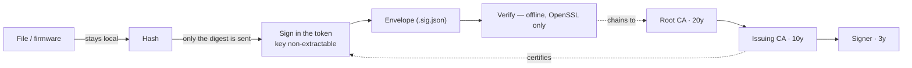

# ✈️ Project TailNumber

### detached Hash-Signing as a Service — **dHSaaS**

&nbsp;
&nbsp;
&nbsp;
&nbsp;

*Sign a hash, not the file. Verify offline. Survive the platform.*

> **⚠️ Proprietary — closed source.** Public overview only; the implementation is private and
> **not distributed**. No rights are granted to use, copy, or deploy — see [`LICENSE`](LICENSE).
> © 2026 rayketcham-lab.

> **The public demo has been retired.** The service, dashboard and API endpoints are offline and
> the URLs no longer resolve. Commands and outputs in these docs were captured while it ran; they
> are kept as a record of behaviour, not as something you can execute today.

---

## What it is

A **detached** signing service. A client sends a **digest** — never the file — and gets back a
portable envelope (`.sig.json`: signature, X.509 chain, digest, provenance). Because only the hash
travels, artifact size and classification are irrelevant. Every envelope verifies **offline** with
nothing but OpenSSL and the trust root.

Post-quantum first: **ML-DSA-65 / ML-DSA-87** (FIPS 204), with classical **RSA-3072/4096** and
**ECDSA P-384**, and hybrid (classical + PQC over one digest) for the transition.

Private keys are generated inside a **PKCS#11 token** and are non-extractable — export is refused,
the public half is served freely. Validated against SoftHSM2; the production target is a
**Thales TCT Luna T-Series (T3000)**, FIPS 140-2 Level 3. Moving between them is a config change,
not a code change. → [`docs/HSM.md`](docs/HSM.md)

## Key rotation and CA lifetime — how the chain survives 50 years

An aircraft's software has to stay verifiable for the life of the airframe. The instinct is to
issue a long certificate and be done, but **a 50-year certificate is not 50 years of trust**. Over
that horizon you will migrate algorithms (RSA today, ML-DSA tomorrow), replace HSMs and the people
holding their credentials, and possibly respond to a compromise. Each of those needs a *new key*
while everything already signed stays verifiable. So the thing that actually carries the chain is
**rotation** — certificate lifetime just buys the window to rotate inside.

### The rule

**Rotation mints the next key. It never destroys the previous one.**

Every predecessor stays resolvable: its certificate still chains, verification still answers for
it, and audit entries still name a key that exists. Deleting the outgoing key and reusing its
label — which is what this service used to do — silently rewrites what every historical envelope
and audit record points at. Retiring a key is a separate, deliberate act: stop signing with it,
let its certificate lapse, keep it resolvable.

| Kind | Pattern | Example |
|---|---|---|
| Signing key | `<name>-<seq>` | `tailnumber-codesign-01` → `-02` |
| CA generation | `<name>-g<N>` | `tn-root-g1` → `tn-root-g2` |

Padding is preserved so labels sort lexically, widening only on overflow (`-99` → `-100`); an
unsuffixed label is generation 1 by convention. `POST /api/v1/keys/{label}/rotate` reads the
predecessor's algorithm, issues the next label in the series from the same CA, and returns it with
`predecessor` and `predecessor_retained: true` — refusing with **409** rather than overwriting a
successor that already exists.

### The CA lifecycle — 20 / 10 / 3

**No certificate spans the platform life. A sequence of generations does.**

| Certificate | Valid for | Over a 50-year platform |
|---|---|---|
| **Root CA** | **20 years** | ~3 generations |
| **Issuing CA** | **10 years** | ~5 generations, two per root |
| **Signer** | **3 years** | ~17 generations |

An earlier build issued 55/54/50-year certificates so a single chain covered the whole platform
life. That is the wrong shape. It makes the root effectively un-rotatable — you never practise the
one procedure you will eventually depend on — and it stakes fifty years on one key and one
algorithm, which is precisely the bet post-quantum migration says not to make. Shorter tiers turn
rotation into routine maintenance instead of a once-in-a-career emergency.

A leaf can never outlive its issuer, so signer certificates sit *well* inside the issuing CA:
issuance has to stop far enough before the CA lapses that the certificates expire first. Each tier
is renewed around mid-life, so the successor is established and trusted before the predecessor
goes anywhere near expiry.

Certificates issued from about 2029 onward will cross the RFC 5280 year-2049 boundary where
`UTCTime` gives way to `GeneralizedTime` — a transition that trips a lot of certificate tooling.
The pinned OpenSSL 3.5 and the offline verifier handle post-2049 dates correctly.

### Rolling the CA — designed, not implemented

This is where the 50 years are won or lost, and **the shipped code does not do it**: `ensure_ca()`
creates a single unversioned root and issuing pair with no notion of generations. With a 20-year
root, crossing a root generation inside the platform life is no longer hypothetical — it happens
at least twice. The intended sequence:

1. Generate `tn-root-g2` in the HSM around year 10. `tn-root-g1` stays — it must keep validating
   everything issued under it.
2. Issue `tn-issuing-g2` from the new root.
3. **Overlap.** Both generations live at once: new signers come from `g2`, existing signers keep
   chaining to `g1` until they rotate.
4. Publish a **link certificate** — the new root's public key signed by the old root — so a
   verifier that only trusts `g1` can still build a path to `g2`. Skip this and every relying
   party in the field breaks the day you cut over.
5. Retire `g1` only once nothing still depends on it.

### The other half: expiry ≠ invalid

Rotation keeps *issuance* alive. It does not keep a decades-old signature *verifiable*, and with
these lifetimes that is no longer a footnote. A signer certificate lasts 3 years and its issuing CA
10; a firmware image signed in year 2 and checked in year 30 has an expired signer, an expired
issuing CA, and quite possibly a retired root. The signature is still cryptographically sound, but
a verifier evaluating trust at check time will reject it.

Long, deliberately over-provisioned certificates used to paper over this. On a 20/10/3 cycle they
no longer do, which makes **long-term validation load-bearing rather than optional**: an RFC 3161
signature timestamp proving the signature existed while its certificate was valid, embedded
revocation data so verification never needs a long-dead responder, and periodic archival
timestamps to outrun algorithm decay (JAdES-B-LTA / CAdES-LTA).

**TailNumber ships the sized trust chain, not LTV.** Those attributes are a documented roadmap
item, not shipped behaviour — see [`docs/INTEROP.md`](docs/INTEROP.md) §7 and
[`docs/ROTATION.md`](docs/ROTATION.md). Until they exist, treat the 50-year claim as resting on
rotation discipline plus archived verification evidence, not on the certificates alone.

## How it works

```mermaid
flowchart LR
  F["File / firmware"] -->|"stays local"| H["Hash"]
  H -->|"only the digest is sent"| S["Sign in the token<br/>key non-extractable"]
  S --> E["Envelope (.sig.json)"]
  E --> V["Verify — offline, OpenSSL only"]
  R["Root CA · 20y"] --> I["Issuing CA · 10y"] --> L["Signer · 3y"]
  I -. certifies .-> S
  V -. chains to .-> R
```

## Documentation

[Key rotation](docs/ROTATION.md) · [HSM & Luna](docs/HSM.md) · [API commands](docs/API-COMMANDS.md) ·
[Formats & interoperability](docs/INTEROP.md) · [Tech stack](docs/STACK.md) · [Testing](docs/TESTING.md)

Runnable examples are in [`examples/`](examples/). They target a TailNumber endpoint via
`TN_ENDPOINT` and need a running instance — the retired public demo is no longer one.

## Honest limitations

- **No live instance.** Nothing here can be exercised against the public demo any more.
- **SoftHSM is not hardware.** Keys were non-extractable via PKCS#11, but its token DB is a file on
  disk — software protection. No FIPS validation, no M-of-N quorum, no tamper response.
- **No post-quantum on the retired demo.** ML-DSA is implemented and covered by the acceptance
  suite, but SoftHSM has no PQC mechanisms; ML-DSA and hybrid need Luna firmware 7.15.0.
- **CA generation rollover is unbuilt** (above) — signing-key rotation is implemented; generational
  roots, the overlap period and the link certificate are design only.
- **No long-term validation.** No RFC 3161 timestamps, no embedded revocation data, no archival
  re-timestamping — so a strict verifier will reject a signature once its signer certificate
  expires, even though the signature itself is sound.
- **Luna steps are written against the SDK docs**, not exercised against hardware.

## License

**Proprietary — © 2026 rayketcham-lab. All rights reserved.** No use, redistribution,
modification, or deployment without written permission. See [`LICENSE`](LICENSE).
