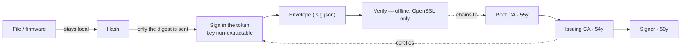

# ✈️ Project TailNumber

### detached Hash-Signing as a Service — **dHSaaS**

&nbsp;
&nbsp;
&nbsp;
&nbsp;

*Sign a hash, not the file. Verify offline. Survive the platform.*

> **⚠️ Proprietary — closed source.** Public overview only; the implementation is private and
> **not distributed**. No rights are granted to use, copy, or deploy — see [`LICENSE`](LICENSE).
> © 2026 rayketcham-lab.

> **The public demo has been retired.** The service, dashboard and API endpoints are offline and
> the URLs no longer resolve. Commands and outputs in these docs were captured while it ran; they
> are kept as a record of behaviour, not as something you can execute today.

---

## What it is

A **detached** signing service. A client sends a **digest** — never the file — and gets back a
portable envelope (`.sig.json`: signature, X.509 chain, digest, provenance). Because only the hash
travels, artifact size and classification are irrelevant. Every envelope verifies **offline** with
nothing but OpenSSL and the trust root.

Post-quantum first: **ML-DSA-65 / ML-DSA-87** (FIPS 204), with classical **RSA-3072/4096** and
**ECDSA P-384**, and hybrid (classical + PQC over one digest) for the transition.

Private keys are generated inside a **PKCS#11 token** and are non-extractable — export is refused,
the public half is served freely. Validated against SoftHSM2; the production target is a
**Thales TCT Luna T-Series (T3000)**, FIPS 140-2 Level 3. Moving between them is a config change,
not a code change. → [`docs/HSM.md`](docs/HSM.md)

## Key rotation — how the chain survives 50 years

Aerospace software must stay verifiable for the life of the airframe. No key lasts that long, so
**rotation is what carries the trust chain**, not key lifetime.

**Rotation mints the next key. It never destroys the previous one.** Every predecessor stays
resolvable — its certificate still chains, verification still answers for it, and audit entries
still name a key that exists. Retiring a key is a separate, deliberate act.

| Kind | Pattern | Example |
|---|---|---|
| Signing key | `<name>-<seq>` | `tailnumber-codesign-01` → `-02` |
| CA generation | `<name>-g<N>` | `tn-root-g1` → `tn-root-g2` |

Padding is preserved so labels sort lexically, widening only on overflow (`-99` → `-100`).

Each tier is sized to outlive the one below, which is what leaves an overlap window to rotate
inside:

| Certificate | Valid for |
|---|---|
| Root CA | **55 years** |
| Issuing CA | **54 years** |
| Signer | **50 years** |

50-year validity crosses the RFC 5280 year-2049 `UTCTime`→`GeneralizedTime` boundary that trips a
lot of tooling; the pinned OpenSSL 3.5 and the offline verifier handle it.

**CA rotation is designed, not implemented.** Generational roots with an overlap period and a
**link certificate** (new root signed by the old) are what let existing relying parties keep
building a path across a cutover. The shipped code creates a single unversioned root and issuing
pair with no notion of generations. → [`docs/ROTATION.md`](docs/ROTATION.md)

## How it works

```mermaid
flowchart LR
  F["File / firmware"] -->|"stays local"| H["Hash"]
  H -->|"only the digest is sent"| S["Sign in the token<br/>key non-extractable"]
  S --> E["Envelope (.sig.json)"]
  E --> V["Verify — offline, OpenSSL only"]
  R["Root CA · 55y"] --> I["Issuing CA · 54y"] --> L["Signer · 50y"]
  I -. certifies .-> S
  V -. chains to .-> R
```

## Documentation

[Key rotation](docs/ROTATION.md) · [HSM & Luna](docs/HSM.md) · [API commands](docs/API-COMMANDS.md) ·
[Formats & interoperability](docs/INTEROP.md) · [Tech stack](docs/STACK.md) · [Testing](docs/TESTING.md)

Runnable examples are in [`examples/`](examples/). They target a TailNumber endpoint via
`TN_ENDPOINT` and need a running instance — the retired public demo is no longer one.

## Honest limitations

- **No live instance.** Nothing here can be exercised against the public demo any more.
- **SoftHSM is not hardware.** Keys were non-extractable via PKCS#11, but its token DB is a file on
  disk — software protection. No FIPS validation, no M-of-N quorum, no tamper response.
- **No post-quantum on the retired demo.** ML-DSA is implemented and covered by the acceptance
  suite, but SoftHSM has no PQC mechanisms; ML-DSA and hybrid need Luna firmware 7.15.0.
- **CA generation rollover is unbuilt** (above).
- **Luna steps are written against the SDK docs**, not exercised against hardware.

## License

**Proprietary — © 2026 rayketcham-lab. All rights reserved.** No use, redistribution,
modification, or deployment without written permission. See [`LICENSE`](LICENSE).
